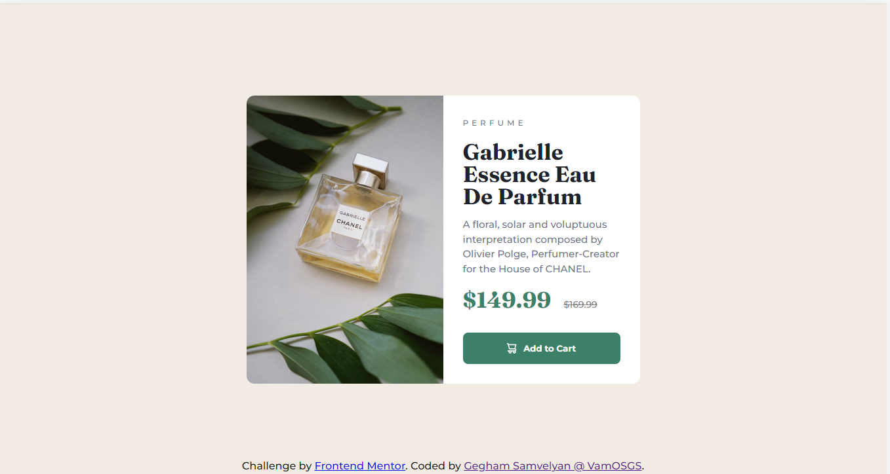

### The challenge

Users should be able to:

- View the optimal layout depending on their device's screen size
- See hover and focus states for interactive elements

### Screenshot

### Links

- Solution URL: [Add solution URL here](https://your-solution-url.com)
- Live Site URL: [Add live site URL here](https://your-live-site-url.com)

## My process

### Built with

- Semantic HTML5 markup
- CSS custom properties
- Flexbox

## Author

- Website - [Gegham Samvelyan @ VamOSGS](https://vamosgs.me)
- Frontend Mentor - [@vamosgs](https://www.frontendmentor.io/profile/VamOSGS)

